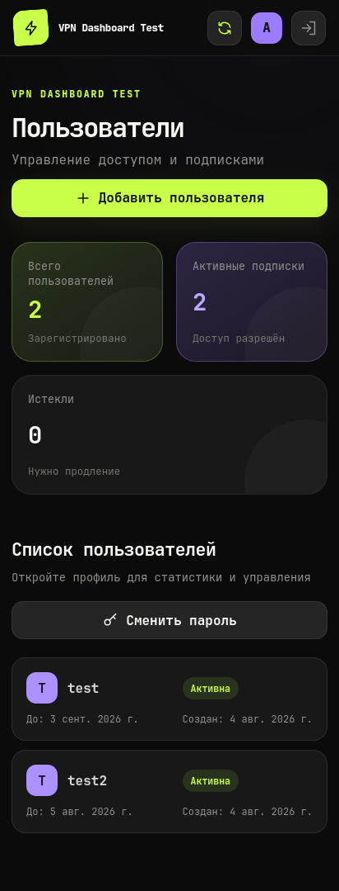
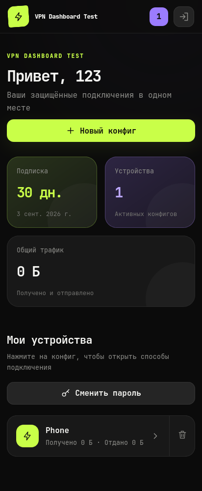
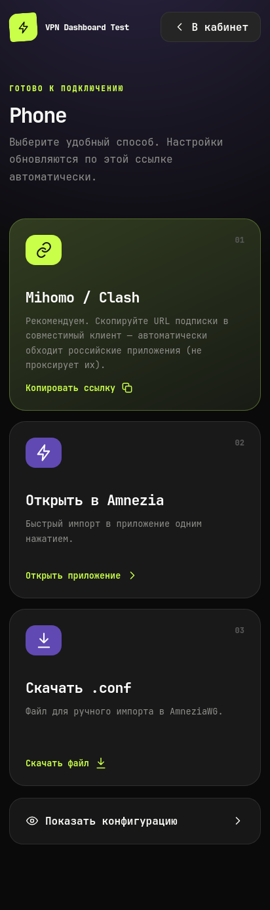

# multi-awg

Админ-панель для AmneziaWG VPN-сервера. Два Go-бинаря (backend + worker) и React-фронтенд.

## Скриншоты

### Админ-панель


### Панель клиента


### Подписка


## Возможности

- **awg-proxy** — маскирует ответы сервера под QUIC, SIP, STUN, DNS и т.д. (обход DPI)
- **mihomo-ядро** — форвардинг трафика с AmneziaWG, поддержка каскадных подключений
- **React-фронтенд** — админ-панель и личный кабинет пользователя
- **AmneziaWG 3.0** — полная поддержка

## Архитектура

```
Frontend ──HTTP──► Backend (cmd/server, :8080) ──HTTP──► Worker (cmd/worker, :9090)
                                                              │
                                                        Docker: amneziawg
                                                        Docker: mihomo
                                                        awg-proxy
```

- **worker** — управляет Docker-контейнерами AmneziaWG/mihomo, генерирует конфиги
- **backend** — авторизация (JWT), админ-CRUD, проксирует запросы на worker

## Быстрый старт

### 1. Конфиг AmneziaWG

Настройте `amnezia-config/awg0.conf`. Пример уже лежит в проекте.

### 2. awg-proxy

Настройте `awg-proxy/proxy.toml` — имитация протокола (`quic`, `sip`, `dns`, `stun`, `auto`).

### 3. mihomo

- `mihomo-config/config.yaml` — основной конфиг для форвардинга
- `mihomo-config/example.yaml` — шаблон для конфигов пользователей

> **Важно:** `nameConfig`, `private_key`, `server_ip`, `server_port`, `client_ip`, `public_key` — плейсхолдеры, подменяются автоматически.

### 4. Переменные окружения

| Файл | Описание | Пример |
|------|----------|--------|
| `.env.server` | Backend | `DB_PATH`, `WORKER_URL`, `WORKER_TOKEN`, `JWT_SECRET`, `MAX_CONFIGS` |
| `.env.worker` | Worker | `AUTH_TOKEN`, `SERVER_ENDPOINT`, `MIHOMO_TEMPLATE` |

См. `.env.server.example` и `.env.worker.example`.

### 5. Константы

- `awg0.conf` — `ListenPort`
- `proxy.toml` — `listen`, `backend`
- `config.yaml` — `device`

## Запуск

### Через Docker (продакшн)

```bash
docker compose up
```

Поднимает весь стек: mihomo, amneziawg, awg-proxy, worker, server.

### Через Docker (локальная разработка)

Собирает образы из локальных Dockerfile вместо ghcr:

```bash
docker compose -f docker-compose.local.yml up --build
```
